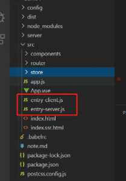

# vue-ssr-dem
## vue服务端渲染探索
优势：1、利于SEO 2、缩短首屏渲染时间

劣势：1、学习成本增高 2、服务端增加压力

## 一、服务端渲染的关键点

### 服务端渲染主要体现在2方面

1. 服务端输出html字符串

2. 服务端和客户端部分代码同构

## 二、服务端渲染的方式

服务端渲染和SPA不同，需要有client和server俩个入口进行打包，因为需要在服务端和客户端分别渲染



### 1、entry-client.js(客户端)中简单的挂载#app

```javascript
import { createApp } from './app.js';

const { app } = createApp();

app.$mount('#app');
```

### 2、entry-server.js（服务端）中是一个简单的promise回调函数，主要是保证在服务端渲染之前获取到初始数据然后返回app组件实例，
```javascript
import { createApp } from './app.js';
export default context => {
  return new Promise((resolve, reject) => {
    const { app, store, router, App } = createApp();
    router.push(context.url);
    router.onReady(() => {
      const matchedComponents = router.getMatchedComponents();
      if (!matchedComponents.length) {
        return reject({ code: 404 });
      }
      Promise.all(matchedComponents.map(component => {
        if (component.asyncData) {
          return component.asyncData({ store });
        }
      })).then(() => {
          context.state = store.state;
        resolve(app);
      });
    }, reject);
  });
}
```
```router.onReady()```为了保证router中的异步懒加载组件加载完成

```router.getMatchedComponents()```用于获取与上下文访问的url匹配的组件


利用组件中的```asyncData```属性来判断哪些组件需要预获取数据，通过```promise.all```的回调保证所有的异步请求数据获取到后，

会把数据存到```store```中，同时把store.state的值赋值给```context.state```，```context.state```这个属性很重要，这个会在服务端渲染时借助```vue-server-renderer```插件在HTML模板中添加

```window.__INITIAL_STATE__```属性。```asyncData```组件中的位置如下：

```javascript
  export default {
    asyncData: fetchInitialData,
    methods: {
      onHandleClick() {
        alert('bar');
      }
    },
    mounted() {
      // 因为服务端渲染只有 beforeCreate 和 created 两个生命周期，不会走这里
      // 所以把调用 Ajax 初始化数据也写在这里，是为了供单独浏览器渲染使用
      let store = this.$store;
      fetchInitialData({ store });
    },
    computed: {
      msg() {
        return this.$store.state.bar;
      }
    }
  }

```

3、客户端index.html模板文件

```javascript
<!DOCTYPE html>
<html lang="en">
<head>
  <meta charset="UTF-8">
  <meta name="viewport" content="width=device-width, initial-scale=1.0">
  <meta http-equiv="X-UA-Compatible" content="ie=edge">
  <title>浏览器渲染</title>
</head>
<body>
  <div id="app"></div>
</body>
</html>
```

前端资源挂载到app的dom中。

### 服务端```ndex.ssr.html```模板文件

```javascript
<!DOCTYPE html>
<html lang="en">
<head>
  <meta charset="UTF-8">
  <meta name="viewport" content="width=device-width, initial-scale=1.0">
  <meta http-equiv="X-UA-Compatible" content="ie=edge">
  <title>服务端渲染</title>
</head>
<body>
  <!--vue-ssr-outlet-->
</body>
</html>
```

服务端渲染的html字符串会通过```vue-server-renderer```插件识别出<!--vue-ssr-outlet-->标记的占位符，插入到此位置（所以模板中这个占位符可不要删除哦）

### 4、store文件

```javascript
if (typeof window !== 'undefined' && window.__INITIAL_STATE__) {
    console.log('window.__INITIAL_STATE__', window.__INITIAL_STATE__);
    store.replaceState(window.__INITIAL_STATE__);
  } else {
    console.log('no browser');
  }
```

```store```中会在浏览器端渲染的时候对windows中的```__INITIAL_STATE__```属性做判断，主要是为了保证服务端和前端的```state```状态一致，前端激活服务端渲染的

页面后可直接从```store```中取值。

## 三、打包配置：

### 1、添加3个配置文件```webpack.base.config.js、webpack.client.config.js、webpack.server.config.js```

```webpack.base.config.js```是基础配置文件，里面配置一些常用的```loader```，这里就不展示了。

```webpack.client.config.js```文件：

```javascript
const path = require('path');
const merge = require('webpack-merge');
const HtmlWebpackPlugin = require('html-webpack-plugin');
const VueSSRClientPlugin = require('vue-server-renderer/client-plugin');
const base = require('./webpack.base.config');

module.exports = merge(base, {
  entry: {
    client: path.resolve(__dirname, '../src/entry-client.js')
  },

  plugins: [
    new VueSSRClientPlugin(),
    new HtmlWebpackPlugin({
      template: path.resolve(__dirname, '../src/index.html'),
      filename: 'index.html'
    })
  ]
});
```

merge了base文件，入口为客户端的```entry-client.js```

```VueSSRClientPlugin```插件作用是生成客户端json文件```vue-ssr-client-manifest.json```，为后续服务端渲染插入```index.ssr.html```中使用。

### ```webpack.server.config.js```文件：

```javascript
const path = require('path');
const merge = require('webpack-merge');
const nodeExternals = require('webpack-node-externals');
const HtmlWebpackPlugin = require('html-webpack-plugin');
const VueSSRServerPlugin = require('vue-server-renderer/server-plugin');
const base = require('./webpack.base.config');

module.exports = merge(base, {
  target: 'node',
   // 对 bundle renderer 提供 source map 支持
  devtool: '#source-map',
  entry: {
    server: path.resolve(__dirname, '../src/entry-server.js')
  },
  externals: [nodeExternals()],
  output: {
    libraryTarget: 'commonjs2'
  },
  plugins: [
    new VueSSRServerPlugin(),  
    new HtmlWebpackPlugin({
      template: path.resolve(__dirname, '../src/index.ssr.html'),
      filename: 'index.ssr.html',
      excludeChunks: ['server']
    })
  ]
});
```

同样merge了base文件，入口为客户端的```entry-server.js```

```VueSSRServerPlugin```插件作用是生成服务端的json文件```vue-ssr-server-bundle.json```，作用server.js文件中会讲

```target: 'node'```的作用是让webpack以适用node的形式处理导入文件方式

```libraryTarget: 'commonjs2'```使用node风格导出模块，用于server端渲染

### 2、server.js文件

server文件为后端服务文件，其中主要处理服务端渲染，以及页面请求的输出等

```javascript
const { createBundleRenderer } = require('vue-server-renderer');
const backendApp = new Koa();
const frontendApp = new Koa();
const backendRouter = new Router();
const frontendRouter = new Router();

const serverBundle = require(path.resolve(__dirname, '../dist/vue-ssr-server-bundle.json'));
const clientManifest = require(path.resolve(__dirname, '../dist/vue-ssr-client-manifest.json'));
const template = fs.readFileSync(path.resolve(__dirname, '../dist/index.ssr.html'), 'utf-8');

const renderer = createBundleRenderer(serverBundle, {
  runInNewContext: false,
  template: template,
  clientManifest: clientManifest
});
```

这段代码主要是使用```vue-server-renderer```插件，来处理服务端渲染，插件中的```createBundleRenderer```方法可以将服务端的```bundle.json```文件

和服务端的模板```index.ssr.html```以及客户端的json资源文件融合，```serverBundle```文件是服务端导出的app实例组价，在这里会被插入进模板中，

```clientManifest```静态资源也会在适当机会```defer```进模板中。

```javascript
const ssrStream = renderer.renderToStream(context);
  ctx.status = 200;
  ctx.type = 'html';
  ctx.body = ssrStream;
```

在```render```中融合的资源通过```render```的```renderToStream```方法输出```html```字符串返回给浏览器端

然后在浏览器端渲染输出。

服务端渲染ssr页面展示如下：


图中1的位置为```server```端打包的```json```文件渲染得出的

图中2的位置为```context.state = store.state```的值，在服务端渲染时复制给window中```__INITIAL_STATE__```属性

并插入模板

图中3的位置为```client```端生成的```json```文件```vue-ssr-client-manifest.json```，在服务端解析渲染时插入的

首屏渲染后，后面页面的操作信息由客户端接管。

## 四、总结

### 1、服务端渲染有些学习成本，对node要有基础

### 2、最好只用于首屏渲染（其他地方使用，感觉作用不大，还浪费资源）

### 3、服务端渲染首屏初始化数据不要太多（服务端渲染请求数据的时间也会导致白屏显示时间过长）
